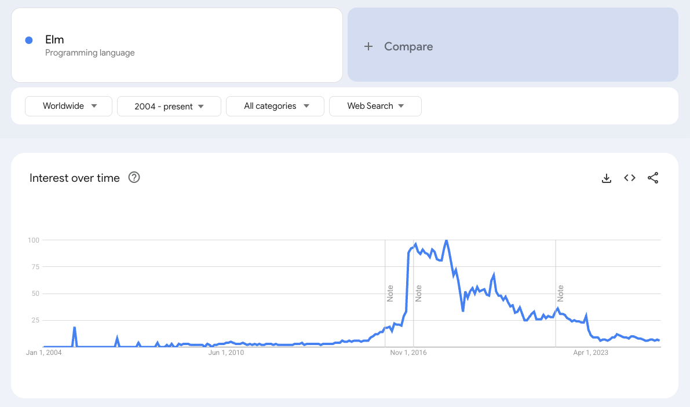
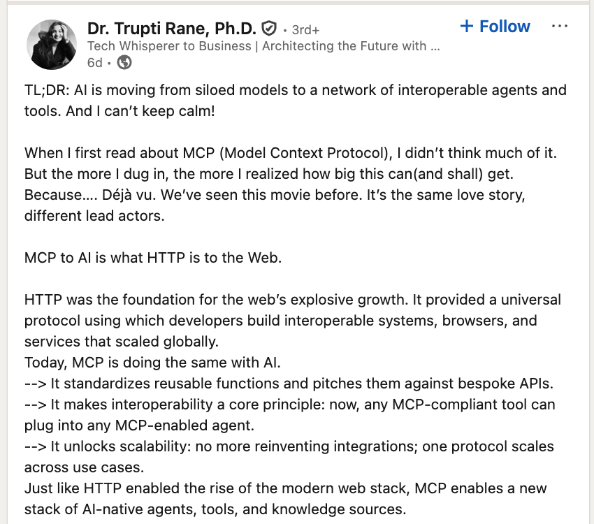

# Defense Against Software Hype Arts

# Case Study: The Air Canada Chatbot

[article source](https://www.theguardian.com/world/2024/feb/16/air-canada-chatbot-lawsuit)

In early 2024, Air Canada had to deal with a situation where their AI chatbot **gave a customer incorrect information about their  fare policy**. The chatbot told a customer they could apply for a discount retroactively after purchasing a full-price ticket, but this wasn't actually Air Canada's policy.

When the customer tried to get the promised refund, Air Canada **initially refused and argued that they weren't responsible for what their chatbot said**. However, a Canadian tribunal ruled that Air Canada was indeed responsible for the information provided by their chatbot, treating it as an official representative of the company.

Air Canada fell for the hype of Chatbots being able to replace real customer service. And they are not the only ones. How can you, when you will be CTOs in your own right be able to avoid 

This is not the worst case. The worst case are those companies who are firing their people thinking that they can replace them with chatbots and artificial programmers. 

- During last meeting, we did have some fun trying to see through the hypes in real time while they were being presented. And I think you've done a very good job.
- And last lecture we saw that in every hype, there often is a useful bit. 

# Plan for today

- Discuss tools that help disentangle the useful from the noise in the middle of a hype

# The Elm Hype - How could you have avoided it? 

In my role here as professor I very often encounter hypes when you and your students come to talk to me about projects. One of these hypes was Elm: I remember one of your colleagues telling me that was the best language for frontend. Look at the image below - it highlights how hypes happen. I can tell you that recently there was no more student who talked to me about Elm.

Languages are almost always hyped based on their expressivity correctness, but the problem is almost never the language. I remember a paper about how people choose programming languages for their project, and the quality or the features of the language is almost never the deciding factor. Think about Javascript. 

How do we know not to fall for the Next Elm hype? 

We have read the "*[No Silver Bullet: Essence and Accident in Software Engineering](https://www.cs.unc.edu/techreports/86-020.pdf)*" by Fred Brooks. We know to distinguish between:
- **Essential complexity** - the inherent, unavoidable difficulty of the software problem itself and the modeling of the problem domain and the solution domain
- **Accidental complexity** - difficulties that arise from our tools, languages, and implementation approaches

# The Hype Playbook - Know Your Enemy

### MCP is like HTTP

The post below is from LinkedIn. Is it [Hyped or Not?](https://www.linkedin.com/posts/dr-trupti-rane-ph-d-75a07621_tldr-ai-is-moving-from-siloed-models-to-activity-7368649597440667650--gw-?utm_source=share&utm_medium=member_desktop&rcm=ACoAAACzBgQB6j6bEmcNzE0sFF6savCpf28EVIQ) 
What gives it away as a hype? 

### MongoDB throws away the SQL baggage

[Hyped or Not? MongoDB](https://www.youtube.com/watch?v=0X43QfCfyk0&ab_channel=MongoDB)

- *"A traditional way that worked well in the past..."* -- appealing to the novelty effect -- we somehow associate something that's new with something that's better... this is implied here. But we don't fall for that: 
	- *we know all the baggage that comes with SQL* - yes... and that's exactly the point of the Spolsky article [Things You Should Never Do, Part I](https://www.joelonsoftware.com/2000/04/06/things-you-should-never-do-part-i/) article on - **wanting to throw away the old system because it's ugly and start with a new one**
	- G.K. Chesterton and his concept of "Chesterton's Fence" -- Don't take a fence down, until you know the reason it was put up. 

### MCP combines Microservices with AI ! 

[Hyped or Not? MCP combines Microservices with AI!](https://www.youtube.com/watch?v=f3tWgpIZemg)
- What's her incentive? (probably a book sale)

## Common hype tactics
- Cherry-picked metrics (“10x faster!” - at what? under which conditions?)
- Survivorship bias (only success stories presented)
- False dichotomies (“Old way vs. New way” - ignoring hybrid approaches)
- Moving goalposts (when criticized, “that’s not what we meant”)
- Buzzword bingo (loading language with impressive but vague terms)
- Broken analogies (prompting making code obsolete just as high level languages made machine code obsolete )

## Red flag checklist
- No trade-offs mentioned
- No failure cases discussed
- “Everyone is doing it”
- Exponential growth

# Framework for defense against hypes

## Understand the Technology

Goal: know the technology well enough to see through the sales pitch. 

### Questions you can ask
- How does this actually work? (understand the mechanism)
- What exactly is being claimed? (force specificity)
- **When does this apply?** (context boundaries)
- What are the **trade-offs** being glossed over? (e.g. blockchain and scalability, ORMs and performance)
- What's the maturity level? (prototype, production-ready)
- Is this genuinely new or a repackaging of existing ideas? ( If you've been around sufficiently, this might be the second coming of an old idea.)
- What’s the **learning curve and complexity**?

[The Law of Leaky Abstractions](https://www.joelonsoftware.com/2002/11/11/the-law-of-leaky-abstractions/). At the very high abstraction level, everything is fine. The devil hides in the details. You must understand them.

## **Be Problem Driven** 
- Is the technology solving a problem you actually have? 
- In the simplest solution? If not remember that: 
	- *Premature optimization is the root of all evil* (who said it?)
	- [Don't let architecture astronauts scare you](https://www.joelonsoftware.com/2001/04/21/dont-let-architecture-astronauts-scare-you/)

## **Analyze the Empirical Evidence** 

Where has this been proven? (demand evidence)

### **Where to look for evidence**

**The evidence hierarchy**
1. Peer-reviewed research (highest quality, but often limited scope)
2. Independent benchmarks (good, but watch for methodology)
3. Industry case studies (useful, but selection bias)
4. Vendor studies and online discussion forums (lowest trust, but sometimes only source)

**Build your own evidence**

Gradually try out a technology <- this is empirical work!
- Define success criteria upfront
- Measurement 
	- Think about how are you going to measure the success
	- This has to be done before starting, paralleling *pre-registration* studies in science
	- Qualitative analysis can also be fine - interviews with the team
- All empirical work has threats to validity, including your own (e.g. the excitement effect on the team)

See the story for next time with the Elm being introduced in a few teams in a React company.

### Empirical Evidence

There is a reason why empirical evidence is hard to get. 

Discussion in class about the challenge of evaluating the claim: **Statically typed programming languages are better than dynamically typed ones.**

## Think About Incentives

### Questions to consider
- Who is making the claim and why? (follow the money)
- Who benefits from adoption? 
- Does the person who sells you the tech benefit? Or maybe they sell you the presentation? (i.e., the shovel salesmen that make more money than the miners)
- What new dependencies are created?
- What costs are minimized in the pitch

# Closing

Next week we’ll see that the answer to almost every technology question is ‘it depends’.

# Project Work

- Continue on your reports; add the **Critical Analysis** part in which you 
	- Discuss the limitations of the technique
	- Make sure to have to understand the problem and the solution well enough to see beyond the hype
- If your hyped technology is historical, try to find examples of companies that fell for the hype although it turned out that it was not a good idea

# Reading for the next time

- [We have left the Cloud](https://world.hey.com/dhh/we-have-left-the-cloud-251760fb) (10 min)
- [The Law of Leaky Abstractions](https://www.joelonsoftware.com/2002/11/11/the-law-of-leaky-abstractions/) (15 min)
- [The Amazon Team that Moved Away from Lambda](https://web.archive.org/web/20240805183535/https://www.primevideotech.com/video-streaming/scaling-up-the-prime-video-audio-video-monitoring-service-and-reducing-costs-by-90) (20 min)
- [On Endings: How and Why We Retired Elm at Culture Amp](https://kevinyank.com/posts/on-endings-why-how-we-retired-elm-at-culture-amp/) (est. 25min)

