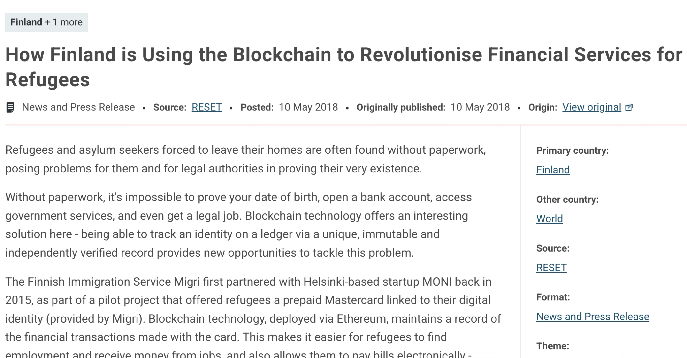

# Blockchain for everything

## Finland Revolutionizes Financial Services for Refugees with the Blockchain

[source](https://reliefweb.int/report/finland/how-finland-using-blockchain-revolutionise-financial-services-refugees)

## Blockchain strategy is reducing paperwork in UAE :)

[source](https://bsvblockchain.org/6-countries-using-blockchain-right-now/)

# Related Reading

2024 - [Bitcoin and Trust](https://mircealungu.com/essays/bitcoin-and-trust.html) - my opinion on why Bitcoin is nothing else than the most expensive metaphor for the importance of trust. Although, it's also a good medium for black market payments.

