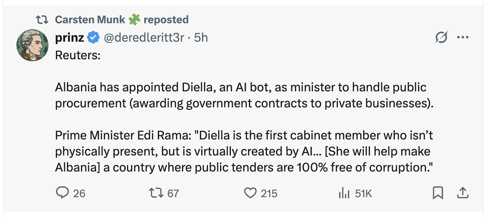

# Gen AI for everything

## Sept 11

[source](https://x.com/deredleritt3r/status/1966183667392196629)

## August, Forbes: [95% of the pilot projects using AI failing](https://x.com/nikos_kafritsas/status/1958195213127540897) 

Hot take by [burkov](https://x.com/burkov/status/1958187627175166384): 
- I said two years ago it would be Hadoop 2.0, and it is. When Hadoop and Big Data were at the peak of hype, managers asked system administrators to connect old, unused laptops that were gathering dust in the basement into a network, install Hadoop on them, and start "crunching data before competitors did." I didn't invent this; I witnessed it myself. No wonder 95% of Hadoop-based proofs of concept failed. With LLMs, it's the same dumb managers, just 10 years older, asking secretaries to automate business processes using Copilot. No wonder 95% of these proofs of concept failed. Companies: fire dumb managers. Managers: stop being dumb and learn how a technology works before you ask someone random to do "what everyone else is doing.
- TODO: read more about companies behind the Hadoop hype: Cloudera and Hortonworks

