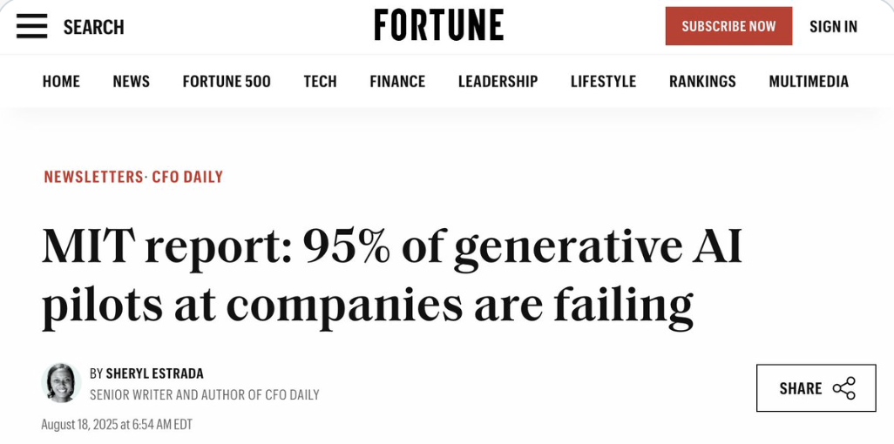
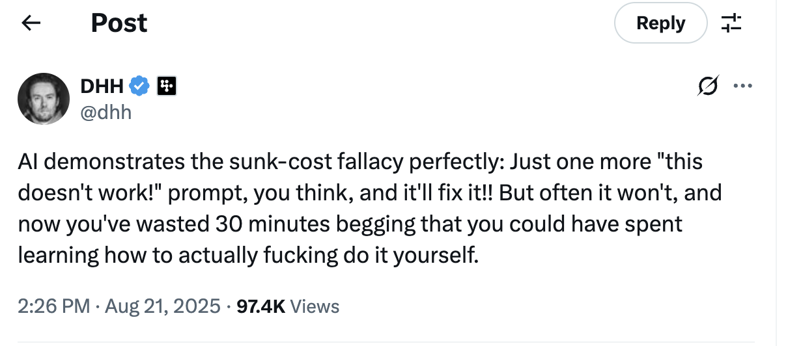

TODO:
- find the airline company that deployed ChatBots with their customer service and had to rollback 
- the Forbes recent articles 

https://x.com/nikos_kafritsas/status/1958195213127540897

### GenAI as Hadoop 2.0
https://x.com/burkov/status/1958187627175166384

I said two years ago it would be Hadoop 2.0, and it is.

When Hadoop and Big Data were at the peak of hype, managers asked system administrators to connect old, unused laptops that were gathering dust in the basement into a network, install Hadoop on them, and start "crunching data before competitors did." I didn't invent this; I witnessed it myself.

No wonder 95% of Hadoop-based proofs of concept failed.

With LLMs, it's the same dumb managers, just 10 years older, asking secretaries to automate business processes using Copilot.

No wonder 95% of these proofs of concept failed.

Companies: fire dumb managers.

Following the AI revolution, I don't think anyone is likely to do fire the junior employees if you mean 'junior as in less experienced'. However, it seems unavoidable that the skill threshold has gone up. I expect employers to raise the bar when hiring software professionals. The fellow who is hired to fill in JSON configuration files: his days are counted. The good news is that young people can easily train themselves to higher skill levels, using AI. The secondary effect is that it will increase the disconnection between college degrees and what employers seek. Colleges will be slow to adapt. In most cases, they do not even want to consider what happens now that ChatGPT can pass most of their exams. I would not be surprised if we ended up with a crisis of purpose. The level you need to reach to be employable might be vastly higher than the level that college degrees typically provide. And don't point out to be able the importance of the basics. ChatGPT can teach you about algorithmics or foundational ideas in software engineering.

https://x.com/lemire/status/1958145670625243275

The positive thing about AI tooling going mainstream and setting expectations high (e.g. "anyone can build software with AI") is that a large group will learn what us devs know already: Creating good software is hard and it's hard to explain to outsiders in a way they understand
[source](https://x.com/GergelyOrosz/status/1958225392432787484)

I cannot help but feel we're hitting peak AI hype, when investors are willingly being take for a ride: A mattress company raising funding to use AI to "fix sleep" A startup to add AI inside jewelry Two examples that both sound ridiculous but raised funding. Not my money...

[source](https://x.com/GergelyOrosz/status/1958157822245437513)

https://x.com/dhh/status/1958505914341654675
