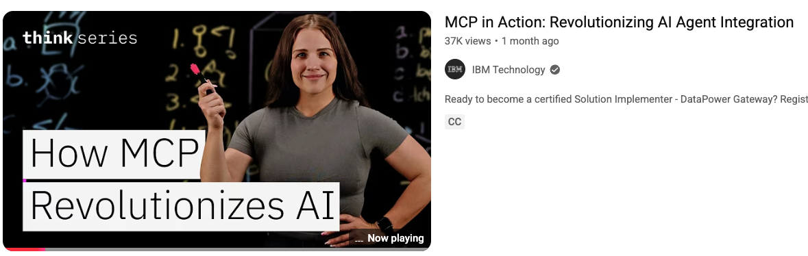
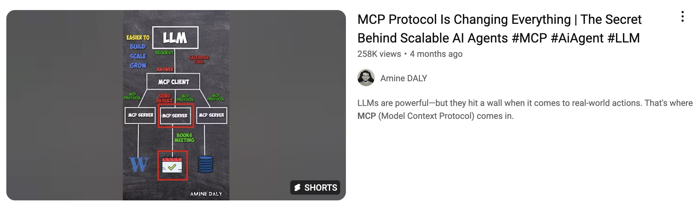

# MCP Revolutionizes AI

## The Hype

Instead of exposing an API your service should expose an chatbot-friendly interface to the functionalities that it provides. 

## In Print

- April, 26, 25 - Forbes: [Why You Need To Know About The Model Context Protocol](https://www.forbes.com/sites/davidbirch/2025/04/26/why-you-need-to-know-about-the-model-context-protocol/)
	- will accelerate the evolution of agentic commerce (a-commerce) - I guess a new buzzword in the making? 
	- the whole article is a whirlwind of buzzwords and unfounded claims

## Video

- the AI can see all the data it 

