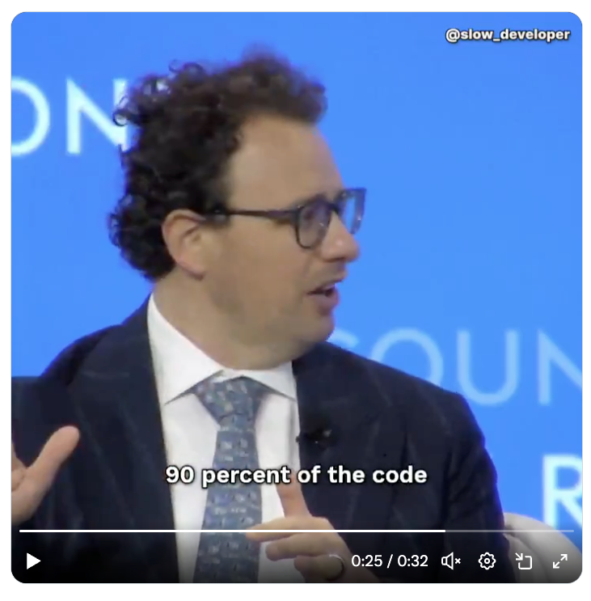
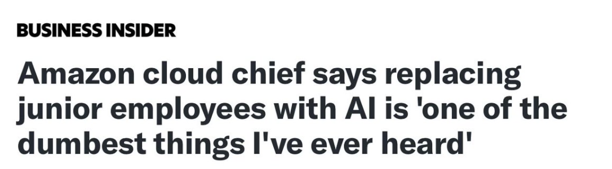
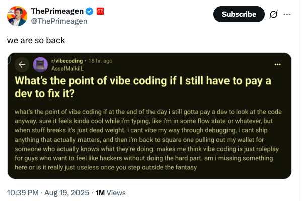
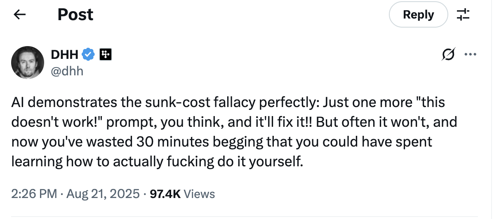

# Promises

## Amodei: 90% of the code written by AI

March 2025 -- Amodei Dario: *"in the next 3 to 6 months, AI is writing 90% of the code, and in 12 months, nearly all code may be generated by AI"*

[business insider](https://www.businessinsider.com/anthropic-ceo-ai-90-percent-code-3-to-6-months-2025-3)

Following the AI revolution, I don't think anyone is likely to do fire the junior employees if you mean 'junior as in less experienced'. However, it seems unavoidable that the skill threshold has gone up. I expect employers to raise the bar when hiring software professionals. The fellow who is hired to fill in JSON configuration files: his days are counted. The good news is that young people can easily train themselves to higher skill levels, using AI. The secondary effect is that it will increase the disconnection between college degrees and what employers seek. Colleges will be slow to adapt. In most cases, they do not even want to consider what happens now that ChatGPT can pass most of their exams. I would not be surprised if we ended up with a crisis of purpose. The level you need to reach to be employable might be vastly higher than the level that college degrees typically provide. And don't point out to be able the importance of the basics. ChatGPT can teach you about algorithmics or foundational ideas in software engineering.
https://x.com/lemire/status/1958145670625243275

# Critiques
## This will be a lesson
The positive thing about AI tooling going mainstream and setting expectations high (e.g. "anyone can build software with AI") is that a large group will learn what us devs know already: Creating good software is hard and it's hard to explain to outsiders in a way they understand
[G. Orosz, tweet](https://x.com/GergelyOrosz/status/1958225392432787484)

## AI will fix sleep - peak Hype? 

[AI mattress company](https://techcrunch.com/2025/08/19/eight-sleep-grabs-100m-to-bring-ai-into-your-bed/) wants to fix sleep. Investors are throwing money at it. 
> With this round, Eight Sleep has raised roughly $260 million total, PitchBook estimates. It previously raised an $86 million Series C in 2021 by investors who assigned it a [$500 million post-money valuation](https://techcrunch.com/2021/08/30/eight-sleep-raises-86m-as-its-smart-mattress-and-sleep-fitness-technology-approach-500m-valuation/). Eight Sleep said its valuation has doubled since its last round, but didn’t disclose specifics.

## *"Roleplaying that you're a hacker"* 

## Learn things yourself

[DHH, tweet](https://x.com/dhh/status/1958505914341654675) 
